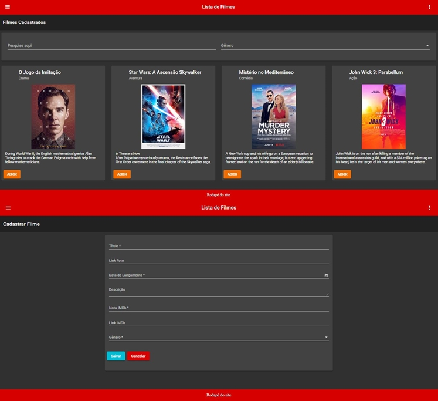

# CRUD MOVIES :movie_camera::heart:

This project was generated with [Angular CLI](https://github.com/angular/angular-cli) version 11.2.9.

## Stacks

    

## Description

This project was carried out during the <a href="https://digitalinnovation.one/" target="_blank">Digital Innovation One</a> course <a href="https://web.digitalinnovation.one/course/tecnicas-avancadas-em-angular-8/learning/d29786af-be10-44d9-8e07-8589f60553ee?back=/track/avanade-angular-developer&bootcamp_id=60feba98-5232-4e30-9484-a7d1f82a8b34" target="_blank">"Advanced techniques in Angular 8"</a>. The project consists of a film system, with the possibility to register, edit, list and view the films.

## Development server

Run `ng serve` for a dev server. Navigate to `http://localhost:4200/`. The app will automatically reload if you change any of the source files.

## Code scaffolding

Run `ng generate component component-name` to generate a new component. You can also use `ng generate directive|pipe|service|class|guard|interface|enum|module`.

## Build

Run `ng build` to build the project. The build artifacts will be stored in the `dist/` directory. Use the `--prod` flag for a production build.

## Simulating the Backend

Run `npm install -g json-server` to globally install the json server. After installation enter the project folder and run `json-server --watch db.json`, with that a server will be started at the url `http://localhost:3000/`, after initialization it will be possible to make http requests.

## Running unit tests

Run `ng test` to execute the unit tests via [Karma](https://karma-runner.github.io).

## Running end-to-end tests

Run `ng e2e` to execute the end-to-end tests via [Protractor](http://www.protractortest.org/).

## Further help

To get more help on the Angular CLI use `ng help` or go check out the [Angular CLI Overview and Command Reference](https://angular.io/cli) page.
